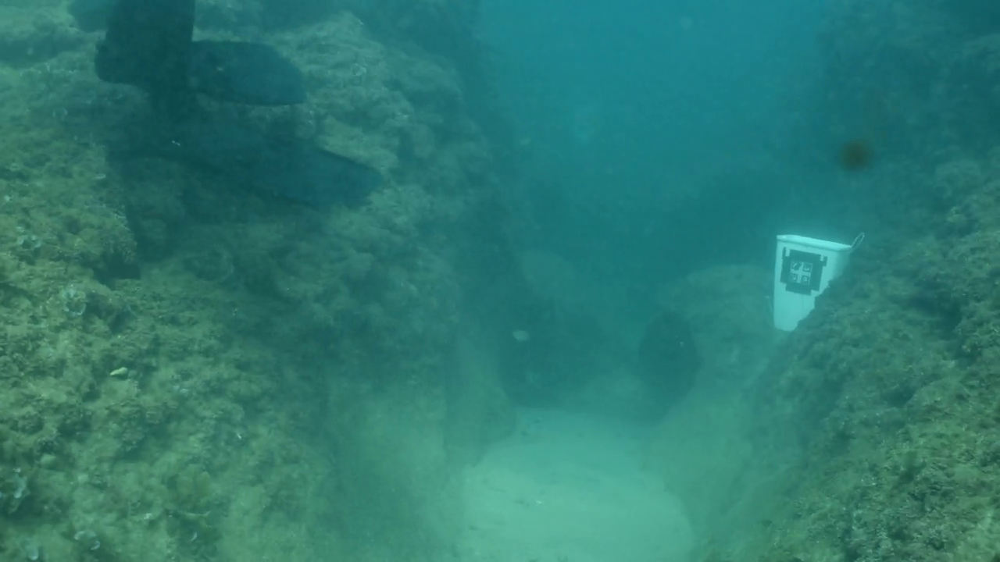

# In-Air-VS-Underwater
This is a project repo specially created for visualizing and comparing different models' performance for underwater datasets. We will include the following:
- Visualization for different encoders
- Visualization of the prediction for models under different settings
- Evaluation for models on different datasets
- Metric explanation on meanings
- Introduction of different datasets
- All related reference links (papers and websites)

Datasets

### Underwater Datasets

#### FLSea Stereo Dataset
- **Size**: Comprises 4 distinct stereo subsets with each subset containing thousands of image pairs, totaling over 7337(3803+2362+867+305) synchronized stereo image pairs. The dataset ptovides both RGB images and dense depth maps.
- **Issues**: The distribution of the subset is pretty skew, as it contains two extreme small subsets(smaller than 1000), and the total number of samples is quite small to be directly used for training and finetuning. On the other hand, depth maps were generated based on SFM techniques, so it contains large missing parts within the depth maps. The most important issue is that it is not a close-up dataset as expected.
- **Content**: Consists of high-resolution RGB underwater images acquired in shallow Mediterranean waters near Israel. Each stereo pair is accompanied by detailed calibration data—including intrinsic and extrinsic camera parameters—and ground truth depth maps generated using photogrammetry. The dataset features diverse underwater scenes showcasing coral reefs, marine flora and fauna, and various natural and man-made structures.
- **Purpose**: Designed to support research in underwater computer vision tasks such as depth estimation, 3D reconstruction, visual odometry, SLAM, obstacle detection, and autonomous underwater navigation. We decide to use it for accessing understandbility of the model for underwater rather than understandbility for close-up scenes.
- **Source**: [FLSea Dataset Publication](https://arxiv.org/abs/2302.12772) | [GTS.AI FLSea Stereo Dataset](https://gts.ai/dataset-download/flsea-stereo-dataset/)
- **Sample Images**:
  
  

#### SUIM (Segmentation of Underwater IMagery)
- **Size**: [数据集大小，例如: 1,500 images with pixel-level annotations]
- **Content**: [图像内容描述]
- **Purpose**: Semantic segmentation of underwater scenes
- **Source**: [GitHub Repository](https://github.com/xahidbuffon/SUIM) | [Paper](https://arxiv.org/abs/2004.01241)
- **Sample Images**:
  
  [这里放置示例图片]

#### UIEB (Underwater Image Enhancement Benchmark)
- **Size**: [数据集大小]
- **Content**: [图像内容描述]
- **Purpose**: Underwater image enhancement and restoration
- **Source**: [Project Website](https://li-chongyi.github.io/proj_benchmark.html) | [Paper](https://ieeexplore.ieee.org/document/8917818)
- **Sample Images**:
  
  [这里放置示例图片]

#### USR-248 (Underwater Scene Recognition)
- **Size**: [数据集大小]
- **Content**: [图像内容描述]
- **Purpose**: Scene classification and recognition for underwater environments
- **Source**: [Paper](https://ieeexplore.ieee.org/document/8460552)
- **Sample Images**:
  
  [这里放置示例图片]

### In-Air Datasets (for comparison)

#### COCO (Common Objects in Context)
- **Size**: [数据集大小，例如: 330,000+ images with 80 object categories]
- **Content**: [图像内容描述]
- **Purpose**: Object detection, segmentation, and image captioning
- **Source**: [COCO Dataset](https://cocodataset.org/)
- **Sample Images**:
  
  [这里放置示例图片]

#### ImageNet
- **Size**: [数据集大小，例如: 14 million images across 22,000 categories]
- **Content**: [图像内容描述]
- **Purpose**: Image classification and object recognition
- **Source**: [ImageNet](https://www.image-net.org/)
- **Sample Images**:
  
  [这里放置示例图片]

