# In-Air-VS-Underwater
This is a project repo specially created for visualizing and comparing different models' performance for underwater datasets. We will include the following:
- Visualization for different encoders
- Visualization of the prediction for models under different settings
- Evaluation for models on different datasets
- Metric explanation on meanings
- Introduction of different datasets
- All related reference links (papers and websites)

<h2>Datasets</h2>

### Underwater Datasets

#### FLSea Stereo Dataset(Note that this dataset had been proofed that is not usable due to bad image quality, calibration quality, depth quality
- **Size**: Comprises 4 distinct stereo subsets with each subset containing thousands of image pairs, totaling over 7337(3803+2362+867+305) synchronized stereo image pairs. The dataset ptovides both RGB images and dense depth maps.
- **Issues**: The distribution of the subset is pretty skew, as it contains two extreme small subsets(smaller than 1000), and the total number of samples is quite small to be directly used for training and finetuning. On the other hand, depth maps were generated based on SFM techniques, so it contains large missing parts within the depth maps. The most important issue is that it is not a close-up dataset as expected.
- **Content**: Consists of high-resolution RGB underwater images acquired in shallow Mediterranean waters near Israel. Each stereo pair is accompanied by detailed calibration data—including intrinsic and extrinsic camera parameters—and ground truth depth maps generated using photogrammetry. The dataset features diverse underwater scenes showcasing coral reefs, marine flora and fauna, and various natural and man-made structures.
- **Purpose**: Designed to support research in underwater computer vision tasks such as depth estimation, 3D reconstruction, visual odometry, SLAM, obstacle detection, and autonomous underwater navigation. We decide to use it for accessing understandbility of the model for underwater rather than understandbility for close-up scenes.
- **Source**: [FLSea Dataset Publication](https://arxiv.org/abs/2302.12772) | [GTS.AI FLSea Stereo Dataset](https://gts.ai/dataset-download/flsea-stereo-dataset/)
- **Sample Images**:
  
<table>
  <tr>
    <td align="center">First Subset, img id 000006 left</td>
    <td align="center">First Subset, img id 000006 right</td>
    <td align="center">First Subset, img id 000006 absolute left depth</td>
    <td align="center">First Subset, img id 000006 normalized left depth</td>
  </tr>
  <tr>
    <td align="center">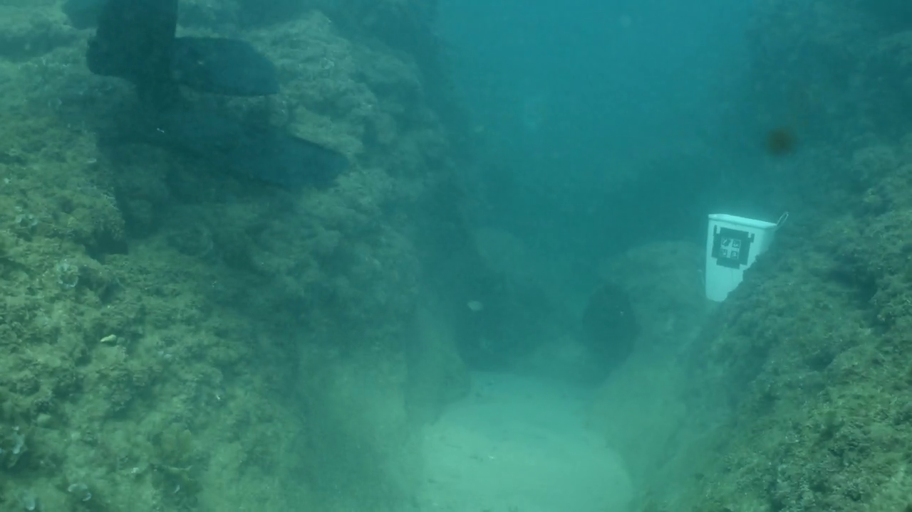</td>
    <td align="center"></td>
    <td align="center"></td>
    <td align="center"></td>
  </tr>
</table>
#### SQUID — Stereo Quantitative Underwater Image Dataset (Ambient Forward-Looking)

* **Size**: **57** synchronized stereo pairs from four Israeli sites—**Katzaa** (15 pairs, 10–15 m), **Satil** (8 pairs, 20–30 m), **Nachsholim** (13 pairs, 3–6 m), **Mikhmoret** (21 pairs, 10–12 m). Release includes **RAW/TIF** images, **camera calibration files**, and **stereo-derived distance maps**. 
* **Issues**: Small overall scale and site imbalance (15/8/13/21) make it better suited for **quantitative evaluation** than large-scale training/finetuning; stereo-derived distances can have limited coverage in texture-poor/occluded regions. *(Assessment based on dataset composition and its evaluation-oriented materials.)* 
* **Content**: Natural **ambient-light**, **forward-looking** underwater scenes spanning tropical (Red Sea) and temperate (Mediterranean) waters; in-scene **color charts** support color-constancy evaluation; each sample includes a **true distance map** computed from stereo. 

* **Purpose**: Designed primarily for **quantitative evaluation of single-image underwater color restoration** using stereo distances as reference; also useful for small-scale analysis of stereo/depth feasibility across water types. Official materials provide a paper, dataset splits, and **evaluation code**.

* **Source**: [Publication (arXiv)](https://arxiv.org/abs/1811.01343) | [Dataset Page](https://csms.haifa.ac.il/profiles/tTreibitz/datasets/ambient_forwardlooking/index.html) | [Evaluation Code (GitHub)](https://github.com/danaberman/underwater-hl)

* **Sample Images**:

<table>
  <tr>
    <td align="center">Site: Katzaa — Left</td>
    <td align="center">Site: Katzaa — Right</td>
    <td align="center">True Distance(left)</td>
    <td align="center">True Distance(right, lower quality)</td>
  </tr>
  <tr>
    <td align="center"></td>
    <td align="center"></td>
    <td align="center">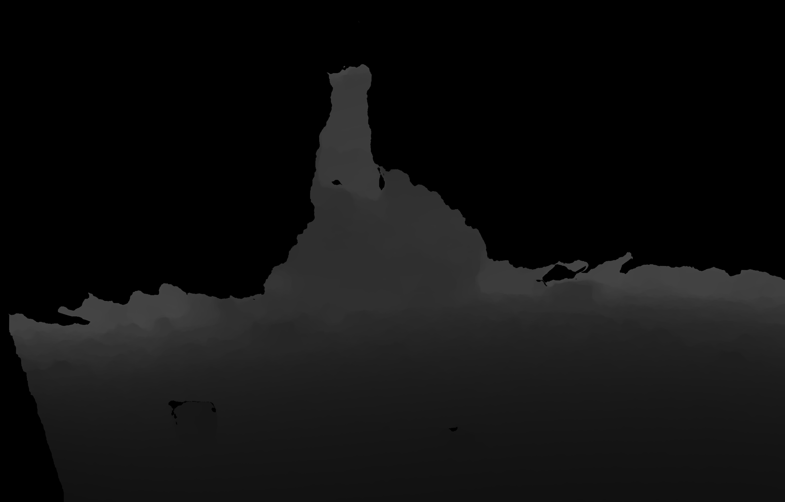</td>
    <td align="center"></td>
  </tr>
</table>

### In-Air Stereo Datasets
#### TartanAir (A Dataset to Push the Limits of Visual SLAM)
- **Size**: Approximately 1 million frames (around 4 TB of data) collected from 1037 long motion sequences. It provides left and right RGB image pairs and corresponding depth maps. It also provides pose of the given cameras which may be useful in the future. 
- **Issue**: Similarly, the depth range of Tartan-Air is still too large. For exmaple, the given sample shown below is of 1.94~77.81 meters.
- **Content**: Multi-modal sensor data captured in photo-realistic simulated environments using Unreal Engine and AirSim. Includes synchronized stereo RGB images, depth maps, segmentation labels, optical flow, LiDAR point clouds, and precise camera poses under diverse conditions such as varying lighting, weather, and dynamic scenes. This dataset is much more larger than the FlSEA dataset mentioned above, which has already shown with good performance of monocular depth estimzatin for underwater environment. In other words, it could be used for training some SOTA models from scratch or doing funtuning.
- **Purpose**: To serve as a challenging benchmark for advancing Visual SLAM and robot navigation algorithms by providing extensive, diverse, and high-fidelity data that mimics real-world complexities.
- **Source**: [TartanAir Dataset Website](http://theairlab.org/tartanair-dataset/) | [Paper](https://arxiv.org/abs/2003.14338)
Note that it contains several subsets for underwater environment.
- **Note that it contains several subsets for underwater environment.**
- **Sample Images**:
  
<table>
  <tr>
    <td align="center">amusement, Easy, P001, id000000, left</td>
    <td align="center">amusement, Easy, P001, id000000, right</td>
    <td align="center">amusement, Easy, P001, id000000, left absolute depth</td>
    <td align="center">amusement, Easy, P001, id000000, normalized left depth</td>
  </tr>
  <tr>
    <td align="center"></td>
    <td align="center"></td>
    <td align="center"></td>
    <td align="center">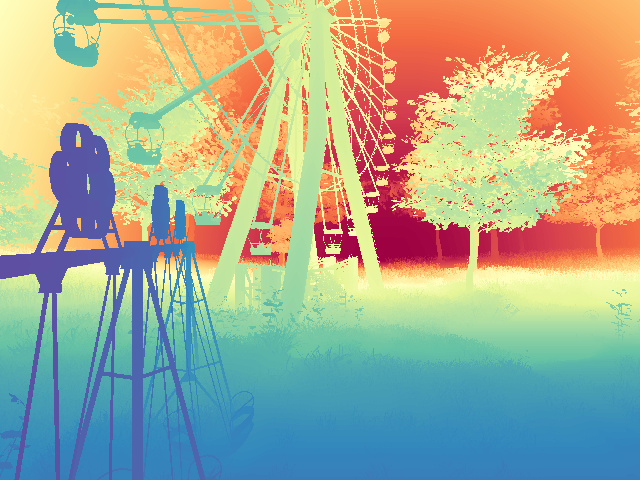</td>
  </tr>
</table>

#### ScanNet
- **Size**: 1513 scanned indoor scenes with over 2.5 million RGB-D frames. Compared with Tartan-Air, the previous one mainly forcusing on out-door scenes and ScanNet focus more on in-door world, which is more likely to satisfied our close-up settings. The depth maps could be rendered into 16-bit png format, which scale is of millimeter. The sample shown beloew is of depth range 1159mm~3763mm(within 4m)
- **Content**: Rich indoor scene data captured with RGB-D sensors, including RGB images, depth maps, and 3D reconstructed meshes. Each scan is accompanied by detailed semantic annotations for objects and surfaces. 
- **Issues**: ScanNet does not originally provide stereo pairs, but it provides the trajectory of the camera, which is more limited. Besides, it would be a good source for unrectified stereo depth/disparity estimation. The depth maps also got missing values which is shown below(the missing proportion is smaller than FlSEA).
- **Purpose**: To facilitate research in 3D reconstruction, semantic segmentation, object recognition, and overall scene understanding in complex indoor environments.
- **Source**: [Project Website](http://www.scan-net.org/) | [Paper](https://arxiv.org/abs/1702.04405)
- **Sample Images**:
  
<table>
  <tr>
    <td align="center">scene0370_00, id0, the first frame</td>
    <td align="center">scene0370_00, id100, the thrid frame</td>
    <td align="center">scene0370_00, id0 16-bit depth</td>
    <td align="center">scene0370_00, id0 8-bit</td>
    <td align="center">scene0370_00, id0 normalized depth</td>
  </tr>
  <tr>
    <td align="center"></td>
    <td align="center"></td>
    <td align="center"></td>
    <td align="center"></td>
    <td align="center"></td>
  </tr>
</table>

#### Middlebury Stereo Dataset
- **Size**: Approximately 8–15 high-resolution stereo image pairs, with the overall data volume typically under 1 GB.
- **Content**: Consists of rectified stereo RGB image pairs captured in controlled indoor settings, each accompanied by dense and accurate ground truth disparity maps (which can be converted to depth information using camera calibration parameters).
- **Purpose**: Serves as a classical benchmark for stereo matching and depth estimation algorithms, enabling precise evaluation of disparity calculation and 3D reconstruction methods.
- **Source**: [Middlebury Stereo Benchmark](https://vision.middlebury.edu/stereo/)
- **Samples**:
  This dataset only got a few samples, which could be directly preview online.
#### Others:
- [Scene Flow](https://lmb.informatik.uni-freiburg.de/resources/datasets/SceneFlowDatasets.en.html)
- [Falling Things](https://research.nvidia.com/publication/2018-06_Falling-Things)
- [HR-VS](https://drive.google.com/file/d/1SgEIrH_IQTKJOToUwR1rx4-237sThUqX/view)
- [CREStereo Dataset](https://github.com/megvii-research/CREStereo/blob/master/dataset_download.sh)
- [InStereo2K](https://github.com/YuhuaXu/StereoDataset)
- [Middlebury](https://vision.middlebury.edu/stereo/data/)
- [Sintel Stereo](http://sintel.is.tue.mpg.de/stereo)
- [ETH3D](https://www.eth3d.net/datasets#low-res-two-view-training-data)
Here we did not introduce KITTI series datasets as they are really well known.

### In-Air Table-Top Datasets
#### StereOBJ-1M (Large-scale Stereo Image Dataset for 6D Object Pose Estimation)
- **Size**: Over 393K stereo image frames and more than 1.5M 6D pose annotations, collected from 182 scenes across 11 different environments. It is a table-top pose estimation dataset, which would be a good choice for accessing the performance for close-up environment.
- **Content**: Stereo RGB images capturing 18 diverse objects—including symmetric, transparent, and reflective items—under challenging conditions such as occlusion, specularity, and varying illumination. Each image is fully annotated with accurate 6D object pose data, along with instance masks and bounding boxes.
- **Issues**: This dataset does not originally provide ground truth depth, which would be a challenge to train supervised models and doing evaluatio on unsupervised models. As most unsupervised models still doing evaluation on groud truth depth. The stereo pairs are stored in a single image.
- **Purpose**: Designed to advance research in 6D object pose estimation by providing a large-scale, challenging benchmark that addresses common real-world issues like transparency, occlusion, and environmental variations in stereo imagery.
- **Source**: [arXiv:2109.10115](https://arxiv.org/abs/2109.10115) | [Project Website](https://sites.google.com/view/stereobj-1m)
- **Sample Images**:
  
<table>
  <tr>
    <td align="center"></td>
    <td align="center"></td>
  </tr>
</table>

#### STIOS Dataset (Stereo Instances on Surfaces)
- **Size**: The dataset comprises a large collection of high-resolution stereo image pairs; exact numbers can be found on the official webpage, but it typically contains on the order of hundreds to thousands of stereo pairs. It contains two similar subset that capture the same scene with two different cameras. We could regarded as the same. In each subset, there are 8 different scenes with 24 different stereo images each. Besides, the dataset is of table-top settings.
- **Content**: This dataset features high-quality stereo RGB images captured from various surfaces in diverse environments. Each stereo pair is accompanied by detailed annotations including object instance segmentation masks and, where available, depth information, targeting challenging conditions such as occlusion, transparency, and specular reflections. In summary, it contains normals, pcd, depth, RGB, and instanca annotations.
- **Issues**: The overall dataset size is the smallest one up to know, which is only able to use it for accessing the performance of the model(testing only)
- **Purpose**: Designed to advance research in stereo vision, object instance segmentation, and 6D object pose estimation, the STIOS dataset provides a challenging benchmark for developing and evaluating algorithms under real-world conditions.
- **Source**: [Dataset Website](https://www.dlr.de/en/rm/research/publications-and-downloads/datasets/stereoinstancesonsurfaces)
- **Sample Images**:
  <table>
  <tr>
    <td align="center">left image</td>
    <td align="center">right image</td>
    <td align="center">depth map</td>
    <td align="center">pcd map</td>
    <td align="center">normals map</td>
  </tr>
  <tr>
    <td align="center"></td>
    <td align="center">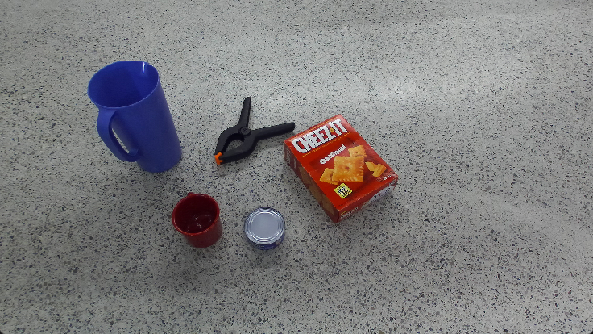</td>
    <td align="center"></td>
    <td align="center">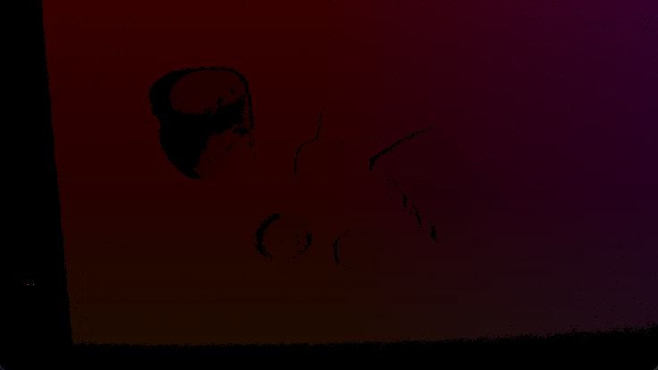</td>
    <td align="center">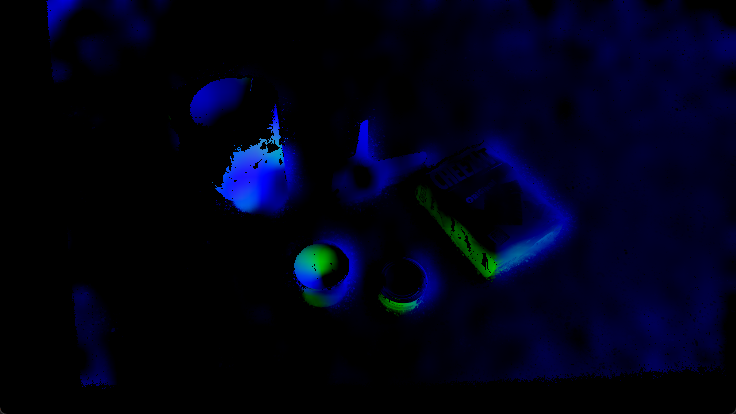</td>
  </tr>
</table>

<h2>Evaluation Metrics</h2>

This section describes the evaluation metrics used to assess the performance of depth estimation and stereo matching algorithms.
Besides, during evaluation, we may only evaluate areas that got non-zero groud turth or within a specific value range in order to aviod make evaluation on meaningless areas and raise with high bias due to ground truth abnormal distribution.
For exmaple, we may only evaluate the metrics that within 5m, and masked the rest of the image.
### Standard Depth Metrics

Our evaluation follows standard metrics used in depth estimation literature:

| Metric | Description | Formula | Better | Meaning |
|--------|-------------|---------|--------|---------|
| abs_rel | Absolute Relative Error | $\frac{1}{N} \sum_{i=1}^{N} \frac{\|d_i - \hat{d}_i\|}{\hat{d}_i}$ | Lower | Measures the average relative depth error, normalized by the true depth. Less sensitive to errors in far regions compared to absolute metrics. |
| sq_rel | Squared Relative Error | $\frac{1}{N} \sum_{i=1}^{N} \frac{\|d_i - \hat{d}_i\|^2}{\hat{d}_i}$ | Lower | Emphasizes larger depth errors by squaring the difference. Particularly sensitive to outliers and severe estimation errors. |
| rms | Root Mean Squared Error | $\sqrt{\frac{1}{N} \sum_{i=1}^{N} \|d_i - \hat{d}_i\|^2}$ | Lower | Measures the average magnitude of depth errors in metric units (e.g., meters). Gives higher weight to larger errors. |
| log_rms | Log Root Mean Squared Error | $\sqrt{\frac{1}{N} \sum_{i=1}^{N} \|\log(d_i) - \log(\hat{d}_i)\|^2}$ | Lower | Measures errors in logarithmic space, making it more sensitive to depth errors in close regions while being more tolerant to errors in distant regions. |
| a1 | Threshold Accuracy (delta < 1.25) | $\%$ of $\max(\frac{d_i}{\hat{d}_i}, \frac{\hat{d}_i}{d_i}) < 1.25$ | Higher | Percentage of pixels where the relative error is within 25%. Indicates high-quality depth predictions. |
| a2 | Threshold Accuracy (delta < 1.25²) | $\%$ of $\max(\frac{d_i}{\hat{d}_i}, \frac{\hat{d}_i}{d_i}) < 1.25^2$ | Higher | Percentage of pixels where the relative error is within 56.25%. Provides a more relaxed accuracy measure. |
| a3 | Threshold Accuracy (delta < 1.25³) | $\%$ of $\max(\frac{d_i}{\hat{d}_i}, \frac{\hat{d}_i}{d_i}) < 1.25^3$ | Higher | Percentage of pixels where the relative error is within 95.31%. Identifies regions with significant errors. |

where $d_i$ is the predicted depth and $\hat{d}_i$ is the ground truth depth.

### Stereo-Specific Metrics
Note that for stereo matching, we could also use those depth metrics mentioned above, just modify it into comparision between disparity will be enough.
For evaluating stereo matching algorithms, we include:

| Metric     | Description                   | Formula                                                                                                            | Better | Meaning                                                                                                                                                          |
| ---------- | ----------------------------- | ------------------------------------------------------------------------------------------------------------------ | ------ | ---------------------------------------------------------------------------------------------------------------------------------------------------------------- |
| EPE-all    | End-Point Error               | \$\frac{1}{N} \sum\_{i=1}^{N} \|disp\_i - \hat{disp}\_i\|\$                                                        | Lower  | Average absolute disparity error in pixels. Directly measures the accuracy of disparity estimation without converting to depth.                                  |
| >3px Error(bad3) | Absolute Disparity Error Rate | \$%\$ of pixels where $\|disp\_i - \hat{disp}\_i\| > 3\$                                                           | Lower  | Percentage of pixels whose disparity error exceeds 3 pixels. A widely used absolute-threshold error metric in stereo evaluation.                                 |
| D1-all     | Disparity Error Rate          | \$%\$ of pixels where $\|disp\_i - \hat{disp}\_i\| > 3\$ AND $\|disp\_i - \hat{disp}\_i\| / \hat{disp}\_i > 0.05\$ | Lower  | Percentage of pixels with "significant" disparity errors (>3px absolute **and** >5% relative). This is the standard error metric for the KITTI Stereo benchmark. |

### Image Synthesis Metrics

For evaluating image reconstruction quality:

| Metric | Description | Formula | Better | Meaning |
|--------|-------------|---------|--------|---------|
| PSNR | Peak Signal-to-Noise Ratio | $20 \cdot \log_{10}\left(\frac{MAX_I}{\sqrt{MSE}}\right)$ | Higher | Measures the ratio between the maximum possible signal power and the noise power. Higher values indicate better quality. Generally, values above 30dB indicate good reconstruction. |
| SSIM | Structural Similarity Index | $\frac{(2\mu_x\mu_y + C_1)(2\sigma_{xy} + C_2)}{(\mu_x^2 + \mu_y^2 + C_1)(\sigma_x^2 + \sigma_y^2 + C_2)}$ | Higher | Measures the perceived similarity between images by considering luminance, contrast, and structure. Values range from 0 to 1, with 1 indicating perfect similarity. More aligned with human perception than PSNR. |
| photo_rmse | Photometric RMSE | $\sqrt{\frac{1}{N} \sum_{i=1}^{N} \|I_i - \hat{I}_i\|^2}$ | Lower | Root mean squared error between pixel values in the reconstructed and ground truth images. Directly measures pixel-wise accuracy of image reconstruction. |

where $I_i$ is the reconstructed image and $\hat{I}_i$ is the ground truth image.

<h2>📊 Baseline Visualization</h2>

TartanAir Underwater Visualization (Zero-shot)

<table style="table-layout: fixed; width: 100%; min-width: 6000px;">
<thead>
<tr>
<th rowspan="2" align="center" style="position: sticky; left: 0; z-index: 10; background: white;">Sample Images (Left | Right)</th>
<th colspan="3" align="center"><a href="https://github.com/NVlabs/FoundationStereo/tree/master">Foundation Stereo</a></th>
<th colspan="3" align="center"><a href="https://github.com/bartn8/stereoanywhere">StereoAnywhere<a></th>
<th colspan="3" align="center"><a href="https://github.com/Windsrain/Selective-Stereo">Selective Raft</a></th>
<th colspan="3" align="center"><a href="https://github.com/Windsrain/Selective-Stereo">Selective IGEV</a></th>
<th colspan="3" align="center"><a href="https://github.com/gangweix/IGEV-plusplus">IGEV++</a></th>
<th colspan="3" align="center"><a href="https://github.com/princeton-vl/RAFT-Stereo/tree/main">Raft Stereo</a></th>
<th colspan="3" align="center"><a href="https://github.com/ZM-Zhou/TiO-Depth_pytorch?tab=readme-ov-file">TiO-Depth</a></th>
<th colspan="3" align="center"><a href="https://github.com/autonomousvision/unimatch/tree/master">Unimatch</a></th>
<th colspan="3" align="center"><a href="https://github.com/haofeixu/aanet">AAnet</a></th>
<th colspan="3" align="center"><a href="https://github.com/JiaRenChang/PSMNet">PSMNet</a></th>
</tr>
<tr>
<th align="center">Training Dataset</th>
<th align="center">Pred Depth </th>
<th align="center">GT Depth</th>
<th align="center">Training Dataset</th>
<th align="center">Pred Depth </th>
<th align="center">GT Depth</th>
<th align="center">Training Dataset</th>
<th align="center">Pred Depth </th>
<th align="center">GT Depth</th>
<th align="center">Training Dataset</th>
<th align="center">Pred Depth </th>
<th align="center">GT Depth</th>
<th align="center">Training Dataset</th>
<th align="center">Pred Depth </th>
<th align="center">GT Depth</th>
<th align="center">Training Dataset</th>
<th align="center">Pred Depth </th>
<th align="center">GT Depth</th>
<th align="center">Training Dataset</th>
<th align="center">Pred Depth </th>
<th align="center">GT Depth</th>
<th align="center">Training Dataset</th>
<th align="center">Pred Depth </th>
<th align="center">GT Depth</th>
<th align="center">Training Dataset</th>
<th align="center">Pred Depth </th>
<th align="center">GT Depth</th>
<th align="center">Training Dataset</th>
<th align="center">Pred Depth </th>
<th align="center">GT Depth</th>
</tr>
</thead>
<tbody>
<tr>
<td align="center" style="position: sticky; left: 0; z-index: 10; background: white;">
<b>Sample_001</b> 
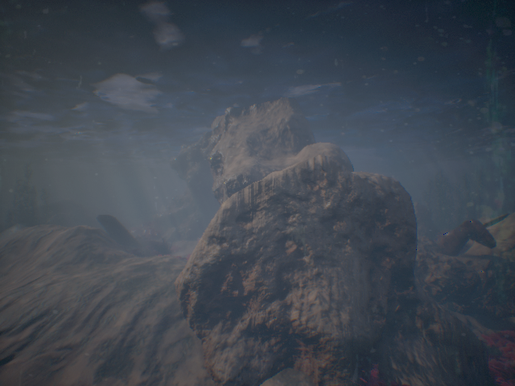

</td>
<td align="center">FSD</td>
<td align="center">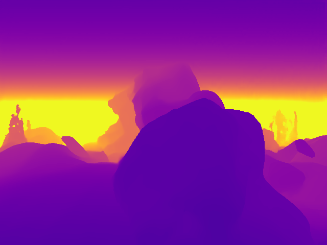</td>
<td align="center">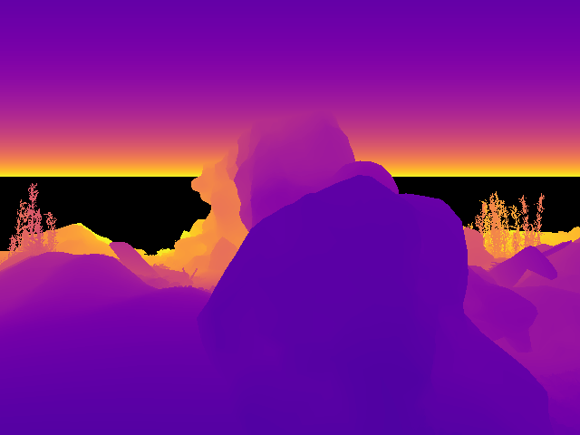</td>
<td align="center">SceneFlow</td>
<td align="center">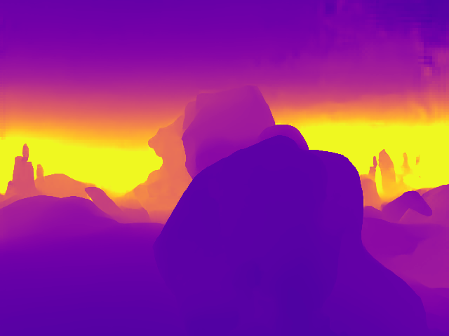</td>
<td align="center"></td>
<td align="center">SceneFlow</td>
<td align="center">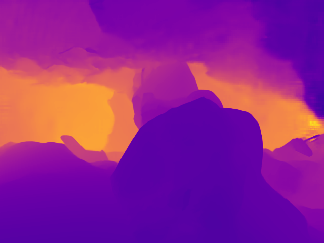</td>
<td align="center"></td>
<td align="center">SceneFlow</td>
<td align="center"></td>
<td align="center"></td>
<td align="center">SceneFlow</td>
<td align="center"></td>
<td align="center"></td>
<td align="center">SceneFlow</td>
<td align="center">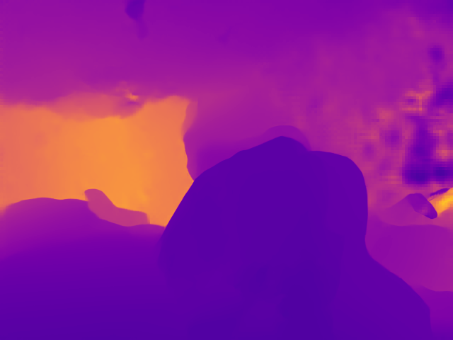</td>
<td align="center"></td>
<td align="center">KITTI2012</td>
<td align="center"></td>
<td align="center"></td>
<td align="center">SceneFlow</td>
<td align="center">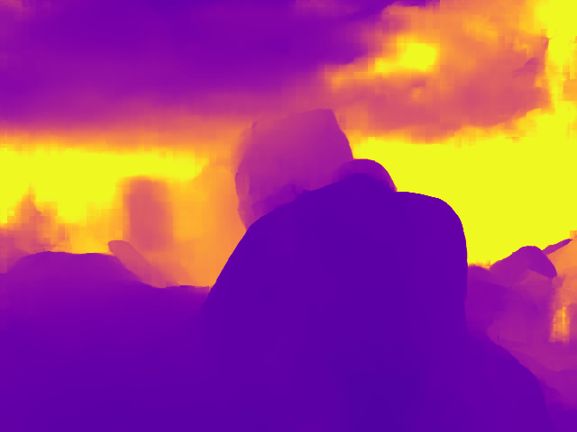</td>
<td align="center"></td>
<td align="center">SceneFlow</td>
<td align="center"></td>
<td align="center"></td>
<td align="center">SceneFlow</td>
<td align="center"></td>
<td align="center"></td>
</tr>

<tr>
<td align="center" style="position: sticky; left: 0; z-index: 10; background: white;">
<b>Sample_002</b> 

</td>
<td align="center"></td>
<td align="center"></td>
<td align="center"></td>
<td align="center"></td>
<td align="center">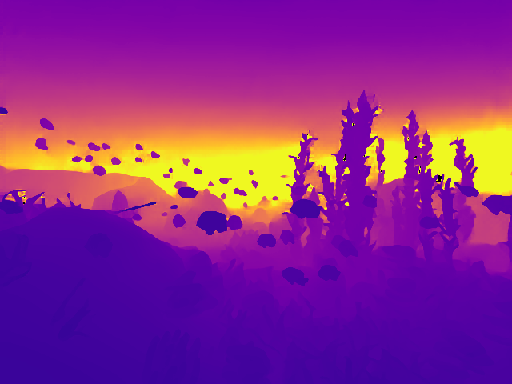</td>
<td align="center"></td>
<td align="center"></td>
<td align="center">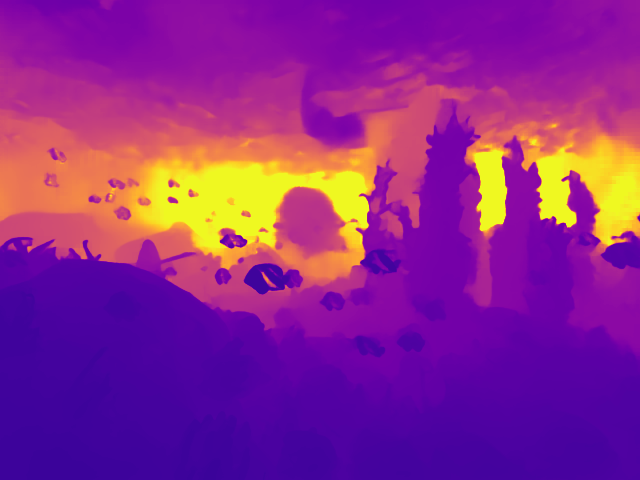</td>
<td align="center"></td>
<td align="center"></td>
<td align="center"></td>
<td align="center"></td>
<td align="center"></td>
<td align="center">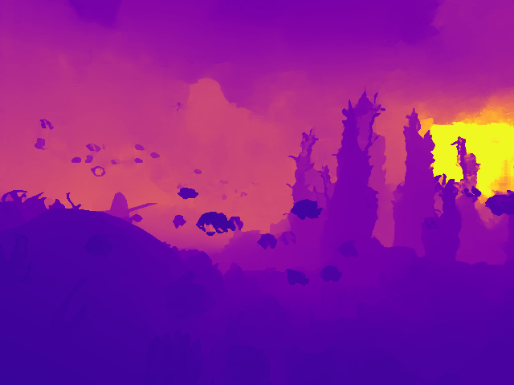</td>
<td align="center"></td>
<td align="center"></td>
<td align="center"></td>
<td align="center"></td>
<td align="center"></td>
<td align="center"></td>
<td align="center"></td>
<td align="center"></td>
<td align="center"></td>
<td align="center"></td>
<td align="center"></td>
<td align="center"></td>
<td align="center"></td>
<td align="center"></td>
<td align="center"></td>
<td align="center"></td>
</tr>

<tr>
<td align="center" style="position: sticky; left: 0; z-index: 10; background: white;">
<b>Sample_003</b> 
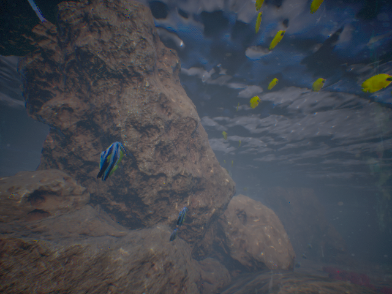

</td>
<td align="center"></td>
<td align="center"></td>
<td align="center"></td>
<td align="center"></td>
<td align="center"></td>
<td align="center"></td>
<td align="center"></td>
<td align="center"></td>
<td align="center"></td>
<td align="center"></td>
<td align="center">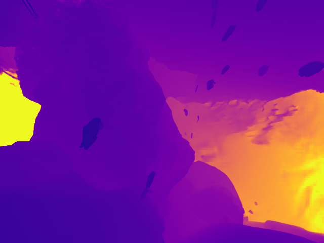</td>
<td align="center"></td>
<td align="center"></td>
<td align="center"></td>
<td align="center"></td>
<td align="center"></td>
<td align="center">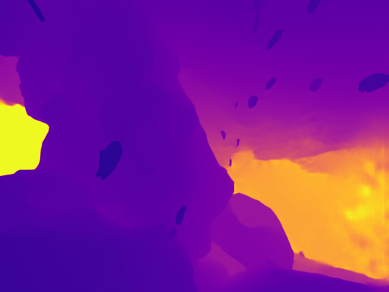</td>
<td align="center"></td>
<td align="center"></td>
<td align="center"></td>
<td align="center"></td>
<td align="center"></td>
<td align="center"></td>
<td align="center"></td>
<td align="center"></td>
<td align="center"></td>
<td align="center"></td>
<td align="center"></td>
<td align="center"></td>
<td align="center"></td>
</tr>

<tr>
<td align="center" style="position: sticky; left: 0; z-index: 10; background: white;">
<b>Sample_004</b> 

</td>
<td align="center"></td>
<td align="center"></td>
<td align="center"></td>
<td align="center"></td>
<td align="center"></td>
<td align="center"></td>
<td align="center"></td>
<td align="center">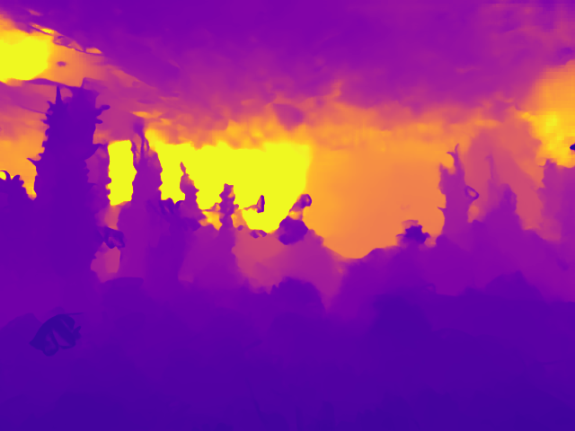</td>
<td align="center"></td>
<td align="center"></td>
<td align="center">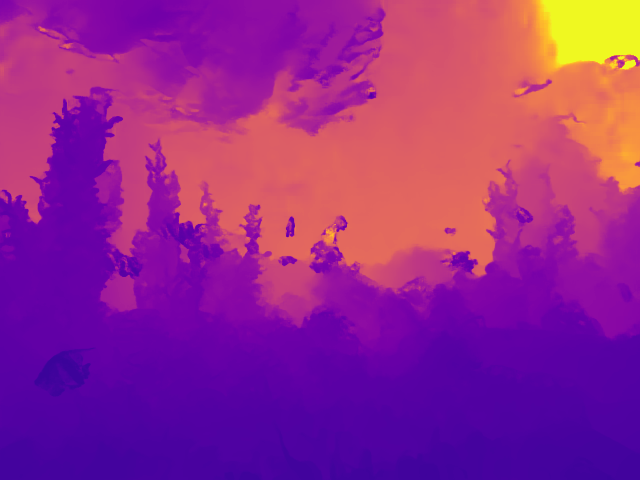</td>
<td align="center"></td>
<td align="center"></td>
<td align="center"></td>
<td align="center"></td>
<td align="center"></td>
<td align="center">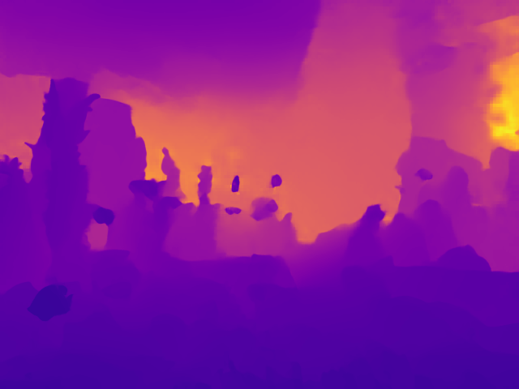</td>
<td align="center"></td>
<td align="center"></td>
<td align="center"></td>
<td align="center"></td>
<td align="center"></td>
<td align="center"></td>
<td align="center"></td>
<td align="center"></td>
<td align="center"></td>
<td align="center"></td>
<td align="center"></td>
<td align="center">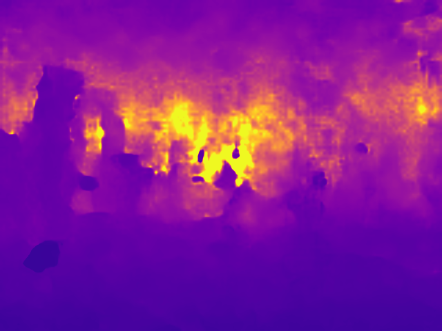</td>
<td align="center"></td>
</tr>

</tbody>
</table>

SQUID Visualization (Zero-shot)

<table style="table-layout: fixed; width: 100%; min-width: 6000px;">
<thead>
<tr>
<th rowspan="2" align="center" style="position: sticky; left: 0; z-index: 10; background: white;">Sample Images (Left | Right)</th>
<th colspan="3" align="center"><a href="https://github.com/NVlabs/FoundationStereo/tree/master">Foundation Stereo</a></th>
<th colspan="3" align="center"><a href="https://github.com/bartn8/stereoanywhere">StereoAnywhere<a></th>
<th colspan="3" align="center"><a href="https://github.com/Windsrain/Selective-Stereo">Selective Raft</a></th>
<th colspan="3" align="center"><a href="https://github.com/Windsrain/Selective-Stereo">Selective IGEV</a></th>
<th colspan="3" align="center"><a href="https://github.com/gangweix/IGEV-plusplus">IGEV++</a></th>
<th colspan="3" align="center"><a href="https://github.com/princeton-vl/RAFT-Stereo/tree/main">Raft Stereo</a></th>
<th colspan="3" align="center"><a href="https://github.com/ZM-Zhou/TiO-Depth_pytorch?tab=readme-ov-file">TiO-Depth</a></th>
<th colspan="3" align="center"><a href="https://github.com/autonomousvision/unimatch/tree/master">Unimatch</a></th>
<th colspan="3" align="center"><a href="https://github.com/haofeixu/aanet">AAnet</a></th>
<th colspan="3" align="center"><a href="https://github.com/JiaRenChang/PSMNet">PSMNet</a></th>
</tr>
<tr>
<th align="center">Training Dataset</th>
<th align="center">Pred Depth </th>
<th align="center">GT Depth</th>
<th align="center">Training Dataset</th>
<th align="center">Pred Depth </th>
<th align="center">GT Depth</th>
<th align="center">Training Dataset</th>
<th align="center">Pred Depth </th>
<th align="center">GT Depth</th>
<th align="center">Training Dataset</th>
<th align="center">Pred Depth </th>
<th align="center">GT Depth</th>
<th align="center">Training Dataset</th>
<th align="center">Pred Depth </th>
<th align="center">GT Depth</th>
<th align="center">Training Dataset</th>
<th align="center">Pred Depth </th>
<th align="center">GT Depth</th>
<th align="center">Training Dataset</th>
<th align="center">Pred Depth </th>
<th align="center">GT Depth</th>
<th align="center">Training Dataset</th>
<th align="center">Pred Depth </th>
<th align="center">GT Depth</th>
<th align="center">Training Dataset</th>
<th align="center">Pred Depth </th>
<th align="center">GT Depth</th>
<th align="center">Training Dataset</th>
<th align="center">Pred Depth </th>
<th align="center">GT Depth</th>
</tr>
</thead>
<tbody>
<tr>
<td align="center" style="position: sticky; left: 0; z-index: 10; background: white;">
<b>Sample_001</b> 

</td>
<td align="center">FSD</td>
<td align="center">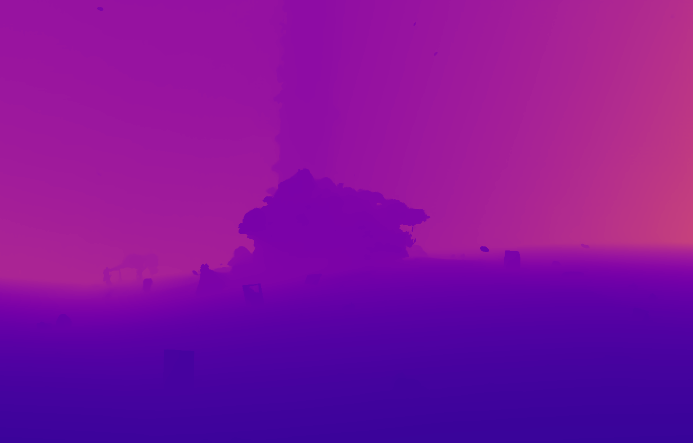</td>
<td align="center"></td>
<td align="center">SceneFlow</td>
<td align="center"></td>
<td align="center"></td>
<td align="center">SceneFlow</td>
<td align="center">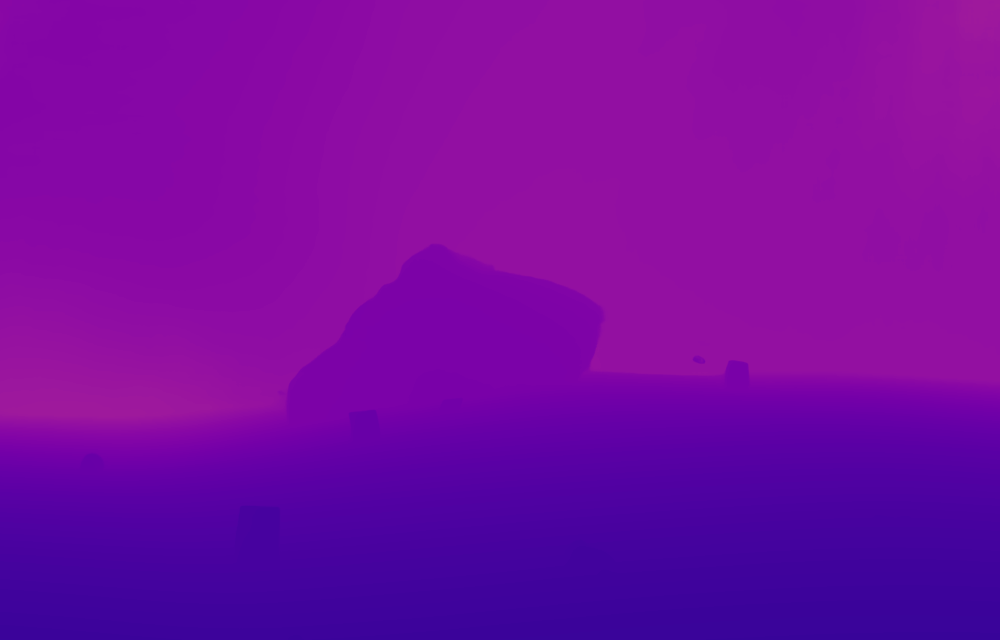</td>
<td align="center"></td>
<td align="center">SceneFlow</td>
<td align="center"></td>
<td align="center"></td>
<td align="center">SceneFlow</td>
<td align="center">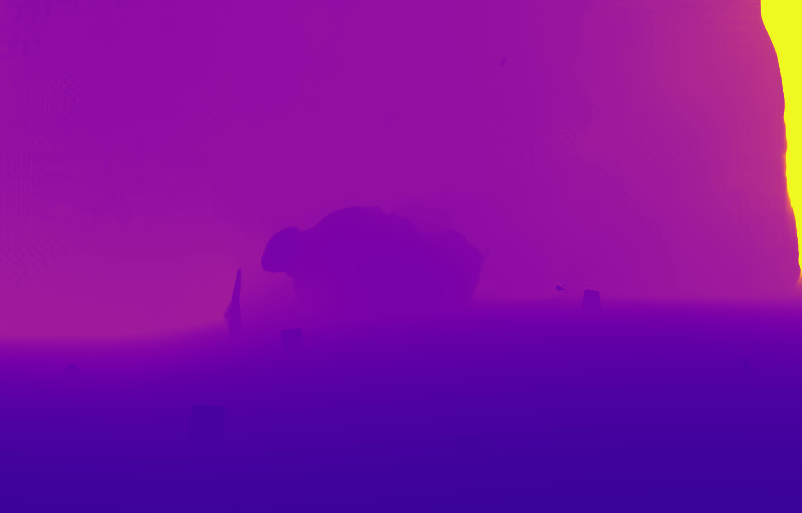</td>
<td align="center"></td>
<td align="center">SceneFlow</td>
<td align="center"></td>
<td align="center"></td>
<td align="center">KITTI2012</td>
<td align="center"></td>
<td align="center"></td>
<td align="center">SceneFlow</td>
<td align="center">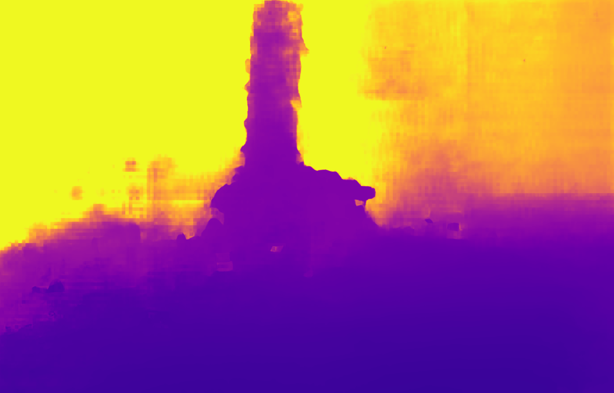</td>
<td align="center"></td>
<td align="center">SceneFlow</td>
<td align="center">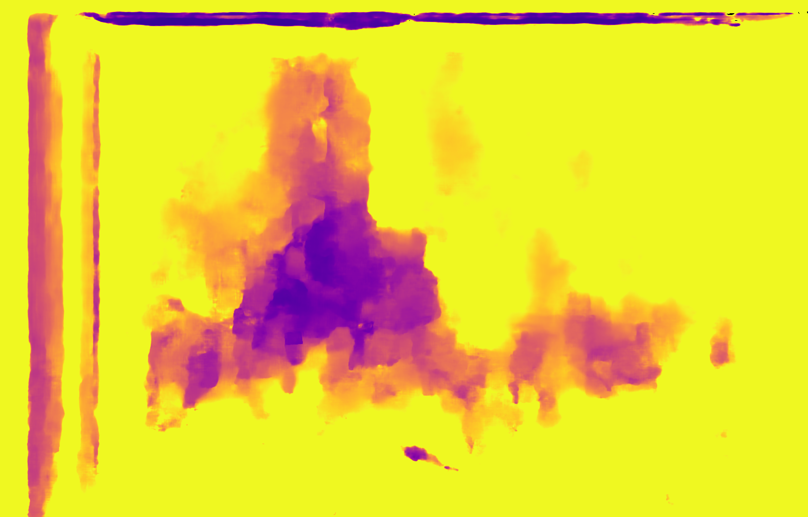</td>
<td align="center"></td>
<td align="center">SceneFlow</td>
<td align="center">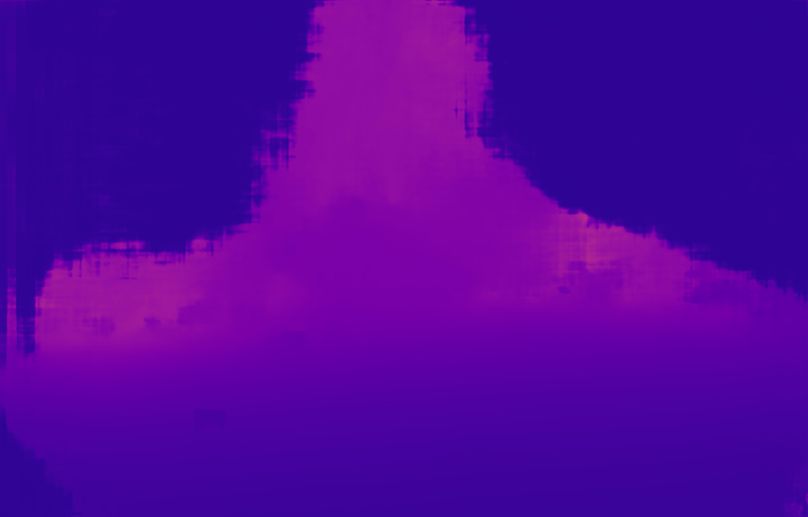</td>
<td align="center"></td>
</tr>

<tr>
<td align="center" style="position: sticky; left: 0; z-index: 10; background: white;">
<b>Sample_002</b> 

</td>
<td align="center"></td>
<td align="center"></td>
<td align="center"></td>
<td align="center"></td>
<td align="center">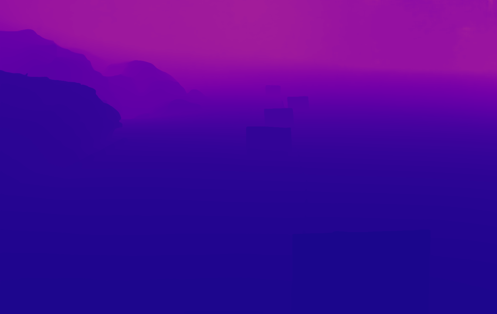</td>
<td align="center"></td>
<td align="center"></td>
<td align="center"></td>
<td align="center"></td>
<td align="center"></td>
<td align="center"></td>
<td align="center"></td>
<td align="center"></td>
<td align="center"></td>
<td align="center"></td>
<td align="center"></td>
<td align="center"></td>
<td align="center"></td>
<td align="center"></td>
<td align="center">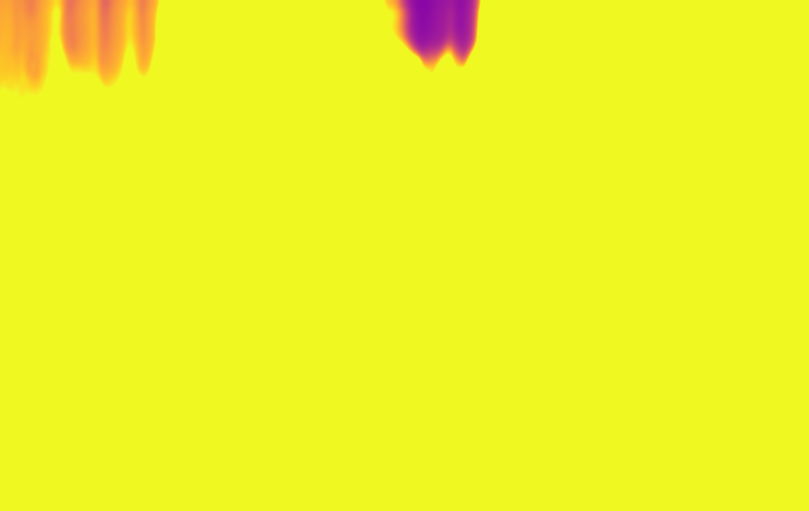</td>
<td align="center"></td>
<td align="center"></td>
<td align="center">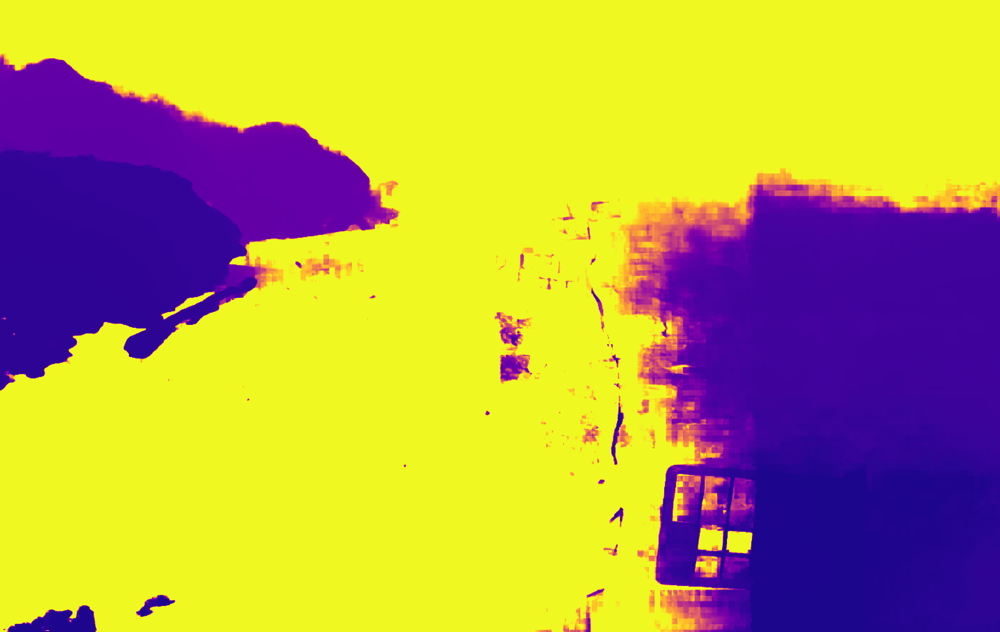</td>
<td align="center"></td>
<td align="center"></td>
<td align="center"></td>
<td align="center"></td>
<td align="center"></td>
<td align="center">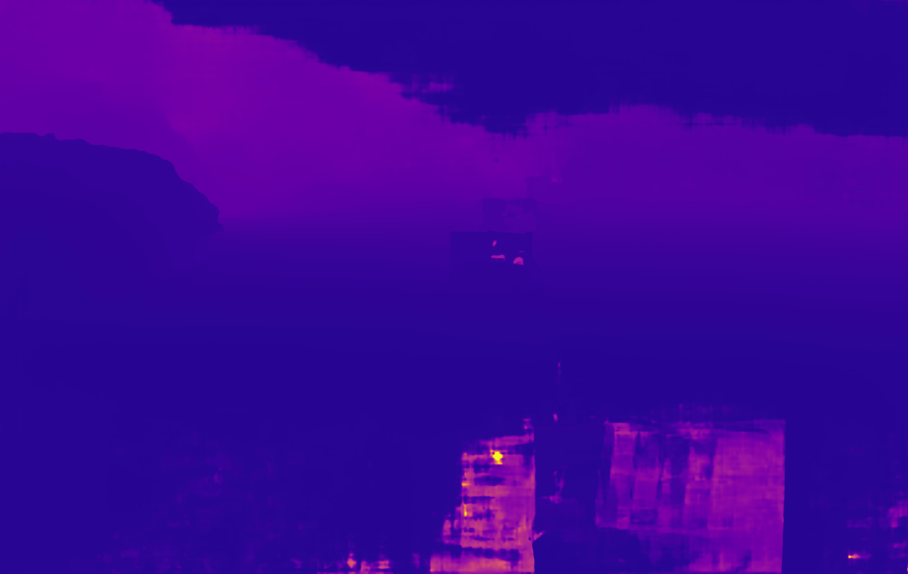</td>
<td align="center"></td>
</tr>

<tr>
<td align="center" style="position: sticky; left: 0; z-index: 10; background: white;">
<b>Sample_003</b> 

</td>
<td align="center"></td>
<td align="center"></td>
<td align="center"></td>
<td align="center"></td>
<td align="center"></td>
<td align="center"></td>
<td align="center"></td>
<td align="center"></td>
<td align="center"></td>
<td align="center"></td>
<td align="center"></td>
<td align="center"></td>
<td align="center"></td>
<td align="center"></td>
<td align="center"></td>
<td align="center"></td>
<td align="center"></td>
<td align="center"></td>
<td align="center"></td>
<td align="center"></td>
<td align="center"></td>
<td align="center"></td>
<td align="center"></td>
<td align="center"></td>
<td align="center"></td>
<td align="center"></td>
<td align="center"></td>
<td align="center"></td>
<td align="center"></td>
<td align="center"></td>
</tr>

<tr>
<td align="center" style="position: sticky; left: 0; z-index: 10; background: white;">
<b>Sample_004</b> 

</td>
<td align="center"></td>
<td align="center">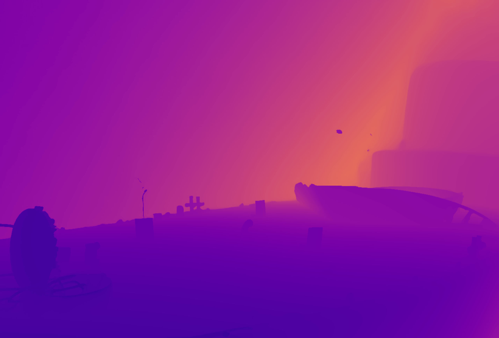</td>
<td align="center">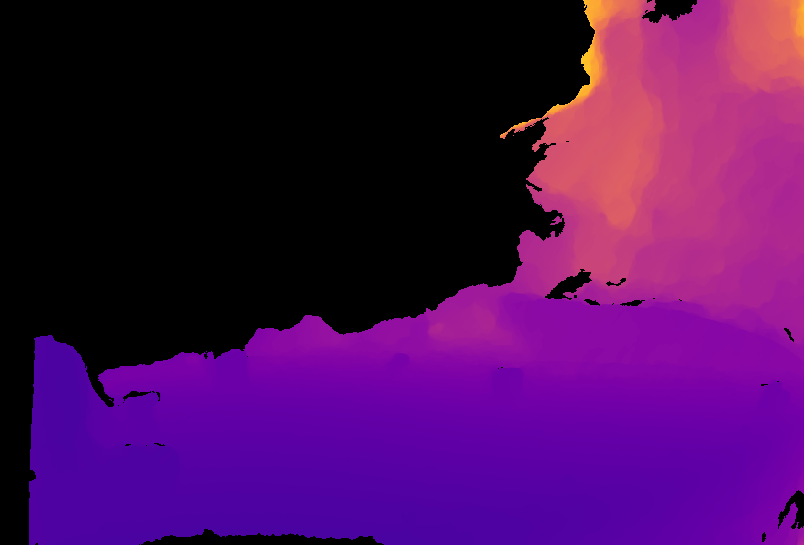</td>
<td align="center"></td>
<td align="center">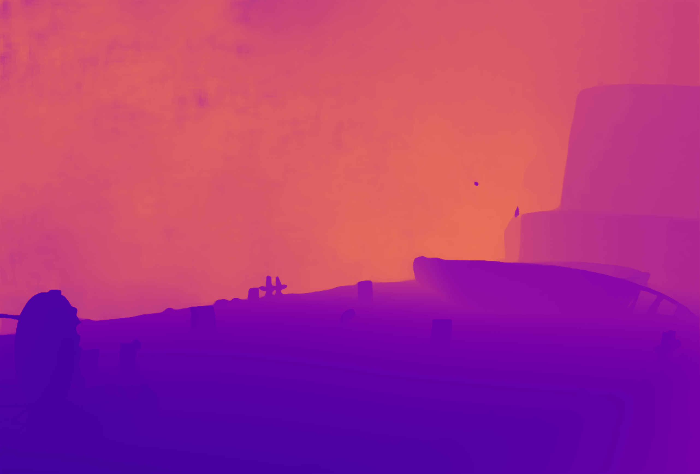</td>
<td align="center"></td>
<td align="center"></td>
<td align="center"></td>
<td align="center"></td>
<td align="center"></td>
<td align="center"></td>
<td align="center"></td>
<td align="center"></td>
<td align="center">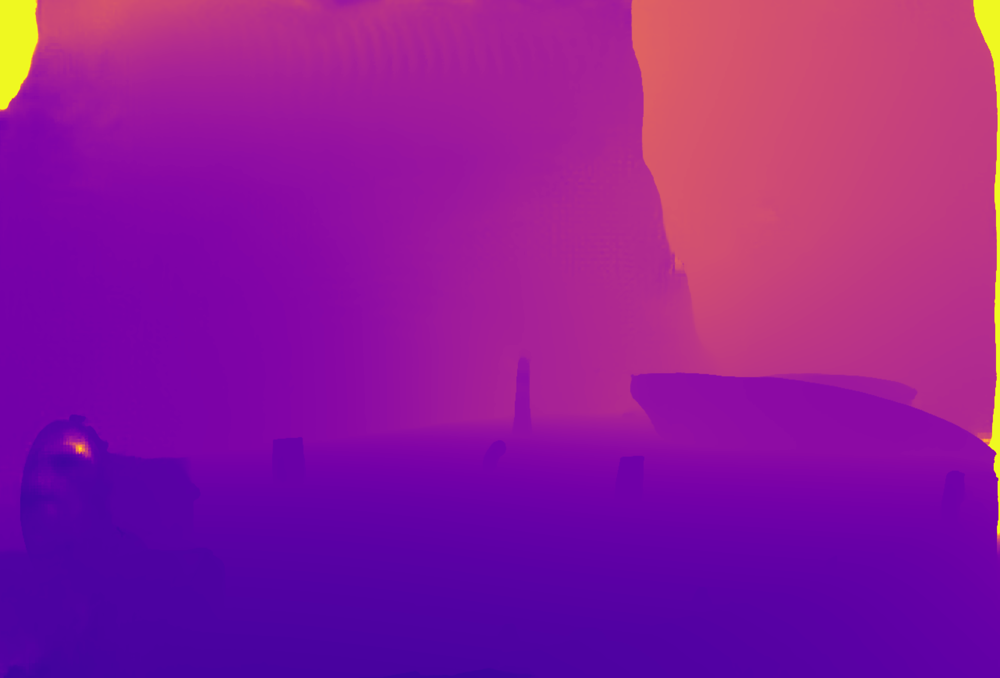</td>
<td align="center"></td>
<td align="center"></td>
<td align="center"></td>
<td align="center"></td>
<td align="center"></td>
<td align="center"></td>
<td align="center"></td>
<td align="center"></td>
<td align="center"></td>
<td align="center"></td>
<td align="center"></td>
<td align="center">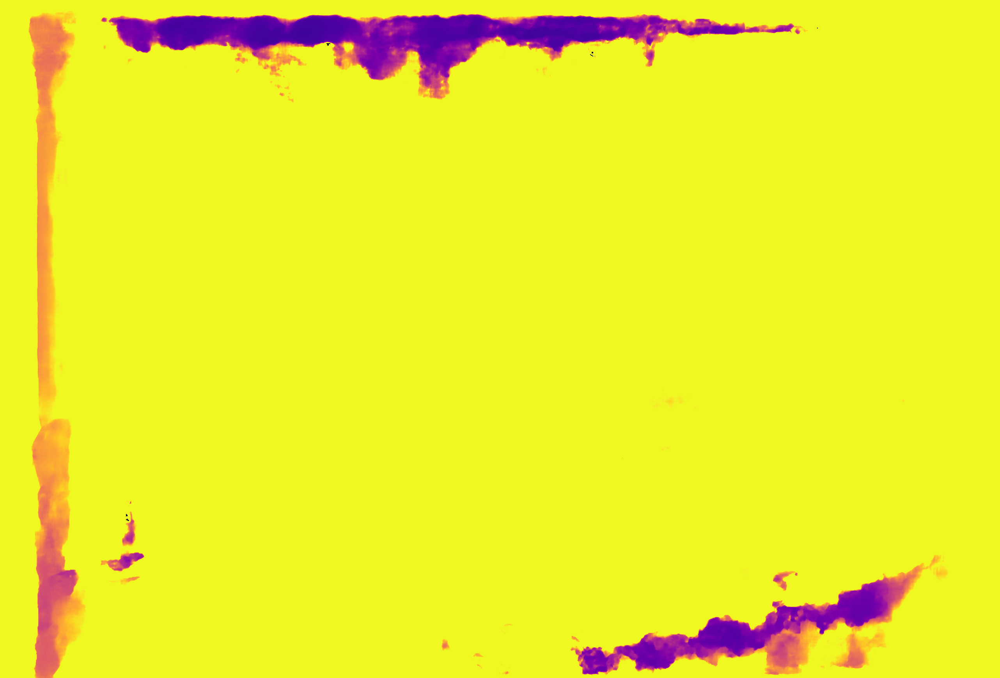</td>
<td align="center"></td>
<td align="center"></td>
<td align="center">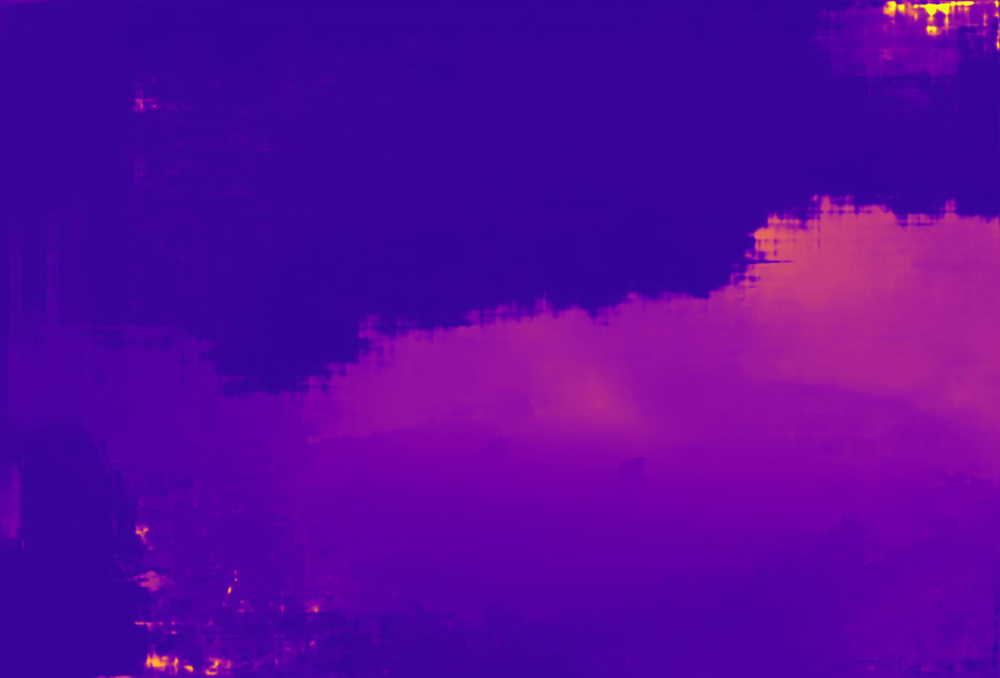</td>
<td align="center"></td>
</tr>

</tbody>
</table>

# Evaluation (10 Methods) — Max Depth: 50m

| method | rel_err | sq_rel_err | rmse | log_rmse | a1 | a2 | a3 | epe | bad3 |
| --- | --- | --- | --- | --- | --- | --- | --- | --- | --- |
| IGEV | 0.1211 | 1.8382 | 5.2505 | 1.6583 | 0.7965 | 0.8546 | 0.8583 | 0.6573 | 0.0286 |
igev_fast|0.1769|4.2943|  6.9560|    0.2720| 0.8699| 0.9240| 0.9512|   0.7645| 0.0456
| raft_stereo | 0.0901 | 0.8176 | 4.5086 | 1.5060 | 0.8127 | 0.8638 | 0.8673 | 0.6020 | 0.0232 |
raftfast|                      0.1345|      2.2306|  5.7489|    0.2354| 0.8636| 0.9333| 0.9632|   0.7152| 0.0380
| AAnet | 0.6857 | 9.3040 | 14.6230 | 2.6826 | 0.2604 | 0.3038 | 0.3338 | 54.9967 | 0.7595 |
| Foundation Stereo | 0.0510 | 0.6126 | 3.2469 | 1.1777 | 0.8597 | 0.8732 | 0.8818 | 0.3702 | 0.0140 |
| psmnet | 0.0984 | 0.9695 | 4.4251 | 1.4873 | 0.8013 | 0.8485 | 0.8799 | 0.7235 | 0.0297 |
| TiO-depth | 0.7969 | 9.5611 | 15.0699 | 2.7127 | 0.0046 | 0.0085 | 0.0487 | 37.8464 | 1.1227 |
| unimatch | 0.1750 | 2.4625 | 6.5423 | 1.8783 | 0.7438 | 0.8140 | 0.8457 | 0.9482 | 0.0449 |
| selective_IGEV | 0.1367 | 1.6968 | 5.4126 | 1.6887 | 0.7549 | 0.8323 | 0.8570 | 0.8178 | 0.0402 |
| selective_RAFT | 0.1057 | 0.9950 | 4.9086 | 1.5910 | 0.7850 | 0.8455 | 0.8753 | 0.7202 | 0.0298 |
| stereoanywhere | 0.0654 | 0.5700 | 3.5224 | 1.2592 | 0.8291 | 0.8639 | 0.8659 | 0.5239 | 0.0175 |

# SQUID Evaluation (10 Methods)

| method | rel_err | sq_rel_err | rmse | log_rmse | a1 | a2 | a3 | epe | bad3 |
| --- | --- | --- | --- | --- | --- | --- | --- | --- | --- |
| igev_plusplus | 0.1044 | 1.6478 | 2.7535 | 1.0129 | 0.9346 | 0.9712 | 0.8773 | 11.4860 | 0.6408 |
| igev_fast | 0.5037 | 13.6135 | 7.4425 | 0.4425 | 0.8394 | 0.8811 | 0.8994 | 39.4948 | 0.5454 |
| igev_fast768 | 0.2740 | 5.2830 | 5.2366 | 0.5374 | 0.7410 | 0.8017 | 0.8418 | 75.6530 | 0.6269 |
raft_stereo | 0.0915 | 0.7795 | 2.1647 | 0.7723 | 0.9235 | 0.9634 | 0.8641 | 11.6019 | 0.6068 |
raft_fast | 0.2734 | 6.5940 | 3.2773 | 0.2430 | 0.8854 | 0.9345 | 0.9528 | 19.6713 | 0.5484 |
| foundation_stereo | 0.0838 | 0.6381 | 2.1736 | 0.7764 | 0.9294 | 0.9698 | 0.8731 | 11.5613 | 0.5761 |
| stereoanywhere | 0.1065 | 1.2326 | 2.7146 | 0.9986 | 0.9179 | 0.9605 | 0.8714 | 10.6866 | 0.5897 |
| selective_igev | 0.1061 | 1.0188 | 2.1200 | 0.7514 | 0.9171 | 0.9555 | 0.8557 | 20.4114 | 0.6153 |
| selective_raft | 0.1285 | 0.4537 | 1.9704 | 0.6782 | 0.8558 | 0.9300 | 0.8641 | 29.8263 | 0.6744 |
| psmnet | 0.5804 | 7.9420 | 5.5248 | 1.7092 | 0.7139 | 0.7909 | 0.7315 | 79.7753 | 0.7895 |
| tio_depth | 1.4735 | 12.9600 | 7.8809 | 2.0644 | 0.1753 | 0.3346 | 0.4584 | 138.5537 | 0.9999 |
| aanet | 8.2848 | 350.2032 | 38.3624 | 3.6471 | 0.0602 | 0.1087 | 0.1391 | 193.6751 | 0.9999 |
| unimatch | 3.7029 | 154.8734 | 20.6817 | 3.0292 | 0.5300 | 0.6076 | 0.5916 | 98.4388 | 0.9501 |

