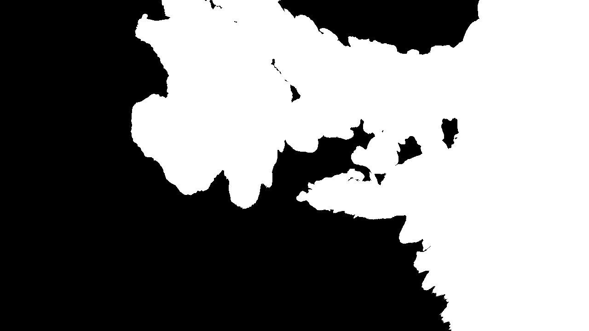
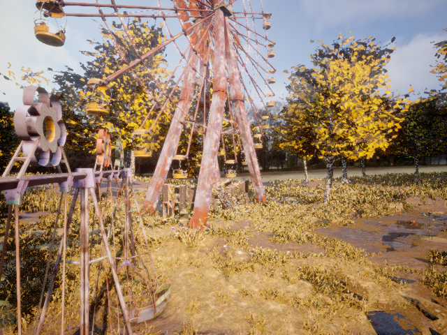
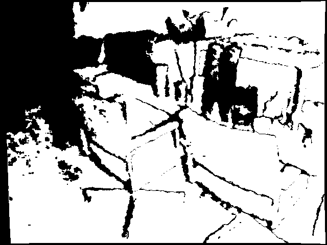
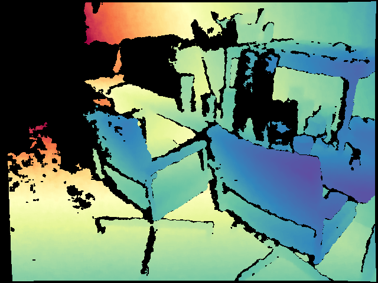

# In-Air-VS-Underwater
This is a project repo specially created for visualizing and comparing different models' performance for underwater datasets. We will include the following:
- Visualization for different encoders
- Visualization of the prediction for models under different settings
- Evaluation for models on different datasets
- Metric explanation on meanings
- Introduction of different datasets
- All related reference links (papers and websites)

Datasets

### Underwater Datasets

#### FLSea Stereo Dataset
- **Size**: Comprises 4 distinct stereo subsets with each subset containing thousands of image pairs, totaling over 7337(3803+2362+867+305) synchronized stereo image pairs. The dataset ptovides both RGB images and dense depth maps.
- **Issues**: The distribution of the subset is pretty skew, as it contains two extreme small subsets(smaller than 1000), and the total number of samples is quite small to be directly used for training and finetuning. On the other hand, depth maps were generated based on SFM techniques, so it contains large missing parts within the depth maps. The most important issue is that it is not a close-up dataset as expected.
- **Content**: Consists of high-resolution RGB underwater images acquired in shallow Mediterranean waters near Israel. Each stereo pair is accompanied by detailed calibration data—including intrinsic and extrinsic camera parameters—and ground truth depth maps generated using photogrammetry. The dataset features diverse underwater scenes showcasing coral reefs, marine flora and fauna, and various natural and man-made structures.
- **Purpose**: Designed to support research in underwater computer vision tasks such as depth estimation, 3D reconstruction, visual odometry, SLAM, obstacle detection, and autonomous underwater navigation. We decide to use it for accessing understandbility of the model for underwater rather than understandbility for close-up scenes.
- **Source**: [FLSea Dataset Publication](https://arxiv.org/abs/2302.12772) | [GTS.AI FLSea Stereo Dataset](https://gts.ai/dataset-download/flsea-stereo-dataset/)
- **Sample Images**:
  
<table>
  <tr>
    <td align="center">First Subset, img id 000006 left</td>
    <td align="center">First Subset, img id 000006 right</td>
    <td align="center">First Subset, img id 000006 absolute left depth</td>
    <td align="center">First Subset, img id 000006 normalized left depth</td>
  </tr>
  <tr>
    <td align="center"></td>
    <td align="center"></td>
    <td align="center"></td>
    <td align="center"></td>
  </tr>
</table>

#### TartanAir (A Dataset to Push the Limits of Visual SLAM)
- **Size**: Approximately 1 million frames (around 4 TB of data) collected from 1037 long motion sequences. It provides left and right RGB image pairs and corresponding depth maps. It also provides pose of the given cameras which may be useful in the future. 
- **Issue**: Similarly, the depth range of Tartan-Air is still too large. For exmaple, the given sample shown below is of 1.94~77.81 meters.
- **Content**: Multi-modal sensor data captured in photo-realistic simulated environments using Unreal Engine and AirSim. Includes synchronized stereo RGB images, depth maps, segmentation labels, optical flow, LiDAR point clouds, and precise camera poses under diverse conditions such as varying lighting, weather, and dynamic scenes. This dataset is much more larger than the FlSEA dataset mentioned above, which has already shown with good performance of monocular depth estimzatin for underwater environment. In other words, it could be used for training some SOTA models from scratch or doing funtuning.
- **Purpose**: To serve as a challenging benchmark for advancing Visual SLAM and robot navigation algorithms by providing extensive, diverse, and high-fidelity data that mimics real-world complexities.
- **Source**: [TartanAir Dataset Website](http://theairlab.org/tartanair-dataset/) | [Paper](https://arxiv.org/abs/2003.14338)
- **Sample Images**:
  
<table>
  <tr>
    <td align="center">amusement, Easy, P001, id000000, left</td>
    <td align="center">amusement, Easy, P001, id000000, right</td>
    <td align="center">amusement, Easy, P001, id000000, left absolute depth</td>
    <td align="center">amusement, Easy, P001, id000000, normalized left depth</td>
  </tr>
  <tr>
    <td align="center"></td>
    <td align="center"></td>
    <td align="center"></td>
    <td align="center"></td>
  </tr>
</table>

#### ScanNet
- **Size**: 1513 scanned indoor scenes with over 2.5 million RGB-D frames. Compared with Tartan-Air, the previous one mainly forcusing on out-door scenes and ScanNet focus more on in-door world, which is more likely to satisfied our close-up settings. The depth maps could be rendered into 16-bit png format, which scale is of millimeter. The sample shown beloew is of depth range 1159mm~3763mm(within 4m)
- **Content**: Rich indoor scene data captured with RGB-D sensors, including RGB images, depth maps, and 3D reconstructed meshes. Each scan is accompanied by detailed semantic annotations for objects and surfaces. 
- **Issues**: ScanNet does not originally provide stereo pairs, but it provides the trajectory of the camera, which is more limited. Besides, it would be a good source for unrectified stereo depth/disparity estimation. The depth maps also got missing values which is shown below(the missing proportion is smaller than FlSEA).
- **Purpose**: To facilitate research in 3D reconstruction, semantic segmentation, object recognition, and overall scene understanding in complex indoor environments.
- **Source**: [Project Website](http://www.scan-net.org/) | [Paper](https://arxiv.org/abs/1702.04405)
- **Sample Images**:
  
<table>
  <tr>
    <td align="center">scene0370_00, id0, the first frame</td>
    <td align="center">scene0370_00, id100, the thrid frame</td>
    <td align="center">scene0370_00, id0 16-bit depth</td>
    <td align="center">scene0370_00, id0 8-bit</td>
    <td align="center">scene0370_00, id0 normalized depth</td>
  </tr>
  <tr>
    <td align="center"></td>
    <td align="center"></td>
    <td align="center"></td>
    <td align="center"></td>
    <td align="center"></td>
  </tr>
</table>

#### USR-248 (Underwater Scene Recognition)
- **Size**: [数据集大小]
- **Content**: [图像内容描述]
- **Purpose**: Scene classification and recognition for underwater environments
- **Source**: [Paper](https://ieeexplore.ieee.org/document/8460552)
- **Sample Images**:
  
  [这里放置示例图片]

### In-Air Datasets (for comparison)

#### COCO (Common Objects in Context)
- **Size**: [数据集大小，例如: 330,000+ images with 80 object categories]
- **Content**: [图像内容描述]
- **Purpose**: Object detection, segmentation, and image captioning
- **Source**: [COCO Dataset](https://cocodataset.org/)
- **Sample Images**:
  
  [这里放置示例图片]

#### ImageNet
- **Size**: [数据集大小，例如: 14 million images across 22,000 categories]
- **Content**: [图像内容描述]
- **Purpose**: Image classification and object recognition
- **Source**: [ImageNet](https://www.image-net.org/)
- **Sample Images**:
  
  [这里放置示例图片]

